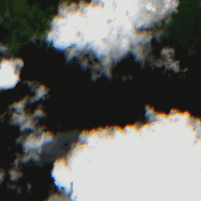
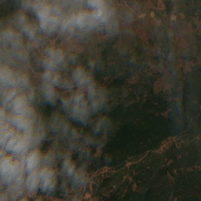
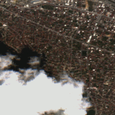
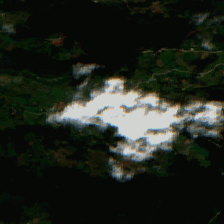
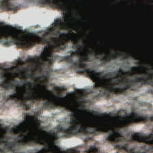
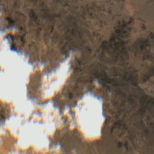

# CloudTran

> :artificial_satellite: Source code accompanying the paper [CloudTran++: Improved cloud removal from multi-temporal satellite images using axial transformer networks]() under review at [MDPI Remote Sensing](https://www.mdpi.com/journal/remotesensing) journal.
>
> :bulb: Inspired by [Colorization Transformer](https://arxiv.org/abs/2102.04432)
>
> :black_nib: Authors: Dionysis Christopoulos, Valsamis Ntouskos, Konstantinos Karantzalos
>
> :classical_building: Remote Sensing Lab, National Technical University of Athens, Greece
>
><p align="left">
>  
></p>

## Paper summary

We propose a novel cloud removal method for **multi-temporal** sattelite images, using Axial Transformer networks. Axial attention offers efficiency, with drastically reduced computational cost compared to the standard self-attention blocks, by applying attention independently on each tensor axis, without sacrificing the global receptive field.

<div align="center">
  
  
  
  

  
  
  
  
</div>

### Network Architecture

CloudTran consists of two components, the `Core` and the `Upsampler`:

<div align="center">
  
</div>

<br>

* The `core` network is an encoder-decoder model based on the [Axial Transformer](https://arxiv.org/abs/1912.12180) architecture. It performs cloud removal to a downsampled version of the original inputs, in an autoregressive fashion.
* The `core` network has an auxiliary parallel cloud removal model considering only the encoder outputs.
* The `upsampler` is a parallel, deterministic self-attention based network. It superesolves the downsampled cloud-free image back to the original resolution.

Our models for both individual components have been trained on two NVIDIA Quadro RTX 6000 GPUs with 24GB of VRAM each. Training with fewer resources can be achieved by adjusting the model size. Additional details regarding hyperparameter tuning on **Implementation section on paper!!**.

To evaluate the performance of our models and compare the resulted cloud-free images with baselines, we use metrics like PSNR, SSIM, MSE and FID/KID.

## Requirements

A conda environment named `cloudtran` can be created and activated with:

```
conda env create -f environment.yaml
conda activate cloudtran
```

Alternatively:

```
pip install -r requirements.txt
```

In particular, ensure that the version of TensorFlow is >= 2.6.0

## Dataset

In the **paper** we introduced two new RGB datasets and also adapted the original [SEN12MS-CR-TS](https://github.com/PatrickTUM/SEN12MS-CR-TS) dataset into the desired format. More details regarding the construction methodologies and specific properties of these datasets can be found in the corresponding **section**.

### Dataset download links:
- In-house dataset: [here]()
- SEN12-MS-CR-TS L1C version (rgb): [here]()
- SEN12-MS-CR-TS L2A version (rgb, America & Europe): [here]()

### Dataset Format
For the method to run successfully, the dataset should follow the specified structure shown below:

```
path/to/dataset/
  ┣ masks_final_testset
  ┃   ┣ 00000
  ┃   ┃   ┣ mask_of_patch0.png
  ┃   ┃   ┣ ...
  ┃   ┃   ┗ mask_of_patchT.png # T: number of available dates
  ┃   ┣ ...
  ┃   ┗ N_testset # Total number of patches in the testset
  ┣ masks_final_trainset
  ┃   ┣ 00000
  ┃   ┣ ...
  ┃   ┗ N_trainset # Total number of patches in the trainset
  ┣ videos_final_testset
  ┃   ┣ 00000
  ┃   ┃   ┣ patch0.png
  ┃   ┃   ┣ ...
  ┃   ┃   ┗ patchT.png
  ┃   ┣ ...
  ┃   ┗ N_testset
  ┣ videos_final_trainset
  ┃   ┣ 00000
  ┃   ┣ ...
  ┃   ┗ N_trainset
```

> **_Notes:_**
> - The images can be either **.png** or **.jpeg**.
> - The images in the three datasets mentioned, are in RGB format with pixel intensities in range [0, 255], represented as unsigned 8-bit integers. 
> - The associated cloud masks are binary.
> - The time-series patches ans their cloud masks are in complete correspondence based on the set (trainset or testset).
> - Each indexed folder contains T patches of the same region, where T is the number of available dates in the specified dataset.

> **_Patch name variations:_**
>
> There could be some variations, regarding the patch names, based on the selected dataset:
>
> - **In-house dataset:** _YYYYMMDD_IDX.jpeg_ (IDX is a padded 3-digit index)
> - **SEN12MS-CR-TS (L2A RGB version):** _TILE_YYYYMMDD_IDX.png_ (IDX is a padded 5-digit index)
> - **SEN12MS-CR-TS (L1C RGB version):** _original-patch-name_rgb_time-index.png_

### Custom dataset creation

To integrate a new custom dataset, it is recommended to follow one of the formats: either the SEN12MS-CR-TS (L2A version) or the in-house dataset (if there is no info about the _tile_ name).

**(OPTIONAL)** To implement custom json files for adaptive indexing of the dataset then they should have the following format:

- JSON file used for trainset:

  ```json
  {
    "tile-name":
      {
        "index":"reference-index",
        "region":"roi-(optional)"
      },
      ...
  }
  ```
  where `index` refers to the, cloud-free target image, reference time index.

- JSON file used for testset:

  ```json
  {
    "tile-name":
      {
        "val_index":"validation-reference-index",
        "test_index":"test-reference-index",
        "region":"roi-(optional)"
      },
      ...
  }
  ```
  where `val_index` corresponds to the reference time index of the cloud-free target image and `test_index` corresponds to the reference time index of the cloudy image.


## Configuration Setup

Ensure proper [configuration](https://github.com/rslab-ntua/cloudtran/tree/cloudtran_journal/configs) adjustments are made, according to the desired dataset version and the base network to be utilized. Some exemplary configurations considering `configs/cloudtran_core_train.py` and `configs/cloudtran_core_test.py` are provided below for reference.

**In-house dataset**

<div style="display: flex; align-items: stretch;">
  <div style="flex: 50%; margin-right: 5px;">

```python
# Training
config.random_channel = True
config.resolution = [256, 256]
config.timeline = 6
config.ref_index = 55
config.max_coverage = 30
config.flip_masks = False
config.use_discriminator = True
config.use_augmentation = False
```
  </div>
  <div style="flex: 50%; margin-left: 5px;">

```python
# Validation/Sampling
config.random_channel = False
config.resolution = [256, 256]
config.timeline = 6
config.ref_index = 30
config.max_coverage = 30
config.flip_masks = False
config.use_discriminator = False
```
  </div>
</div>

**SEN12-MS-CR-TS dataset**

<div style="display: flex; align-items: stretch;">
  <div style="flex: 50%; margin-right: 5px;">

```python
# Training
config.random_channel = True
config.resolution = [224, 224]
config.timeline = 6
config.ref_index = 16
config.jsonf = './path/to/trainset.json'
config.max_coverage = 50
config.flip_masks = False # True for L1C version
config.use_discriminator = True
config.use_augmentation = True
```
  </div>
  <div style="flex: 50%; margin-left: 5px;">

```python
# Validation/Sampling
config.random_channel = True
config.resolution = [224, 224]
config.timeline = 6
config.ref_index = 21
config.jsonf = './path/to/testset.json'
config.max_coverage = 30
config.flip_masks = False # True for L1C version
config.use_discriminator = False
```
  </div>
</div>

where `config.ref_index` in training and validation corresponds to the time index of the target, clear from clouds, image. However, during testing, it corresponds to the time index of the cloudy image that needs to be restored.

If `config.jsonf` is defined, then `config.ref_index` is ignored. This adaptive indexing method is only supported for SEN12MS-CR-TS L2A RGB version.

> :exclamation: **NOTE:** Configuration parameters for the upsampler network, `configs/upsampler_train.py` and `configs/upsampler_test.py`, follow a similar approach as the core network configs shown above.

## Training

Run the following command to train the core network

```
MODEL_SIZE=128 python run.py --config ./configs/cloudtran_core_train.py --mode=train --logdir $LOGDIR
```

To train the Upsampler, replace `configs/cloudtran_core_train.py` with `configs/upsampler_train.py`:

```
MODEL_SIZE=512 python run.py --config ./configs/upsampler_train.py --mode=train --logdir $LOGDIR
```

> :exclamation: **NOTE:** Before running the training commands make sure to set `config.data_dir` and `config.mask_dir` found in both `configs/cloudtran_core_train.py` and `configs/upsampler_train.py` with the **_videos_final_trainset_** and **_masks_final_trainset_** paths as shown in the [Dataset Format](#dataset-format) section. Upsampler and Core network can be trained independenlty in parallel.

## Evaluation/Validation

For evaluation, which can be concurrent with the training process,

```
MODEL_SIZE=128 python run.py --config ./configs/cloudtran_core_test.py --mode=eval_valid --logdir /core_ckpt_dir
```

For validation, after each network has trained,

```
MODEL_SIZE=128 python sample.py --config ./configs/cloudtran_core_test.py --mode=sample_valid --logdir /core_ckpt_dir
```

During validation if `config.sample.only_parallel = True` metrics and the respective resulted images consider only the auxilliary Transformer Encoder outputs.

In order to run these processes for the Upsampler network, replace `configs/cloudtran_core_test.py` with `configs/upsampler_test.py` and `core_ckpt_dir` with `up_ckpt_dir`.

> :exclamation: **NOTE:** Before running the evaluation/validation and sampling commands make sure to set `config.data_dir` and `config.mask_dir` found in both `configs/cloudtran_core_test.py` and `configs/upsampler_test.py` with the **_videos_final_testset_** and **_masks_final_testset_** paths as shown in the [Dataset Format](#dataset-format) section.

## Sampling

<!-- ### Single GPU Sampling -->

<!-- Sampling high resolution images is a three step procedure. On a P100 GPU, the colorizer samples a batch of 20 images around 3.5 minutes while on a V100
GPU, the time taken is approximately 90 seconds. The color and spatial upsampler sample in the order of milliseconds. -->

Sampling configurations for each model are described by `config.sample` ConfigDict at `configs/{network}_test.py`

* **sample.num_outputs** - Total number of time-series patches
* **sample.logdir** - Sample write directory.
* **sample.skip_batches** - The first `skip_batches*batch_size` images are skipped.

Ensure that ``num_outputs`` and ``skip_batches`` are the same between both components (core & upsampler).
The generated samples are written as TFRecords and as images if `config.sample.im_outputs = True` to `$logdir/${config.sample.logdir}`

### Core Network

The following command samples low resolution cloud-free 64x64 images.

```
MODEL_SIZE=128 python sample.py --config ./configs/cloudtran_core_test.py --mode=sample_test --logdir /core_ckpt_dir
```

### Upsampler

The following command superresolves the previous output to high resolution 256x256 output.

```
MODEL_SIZE=512 python sample.py --config ./configs/upsampler_test.py --mode=sample_test --logdir /up_ckpt_dir
```

> :exclamation: **NOTE:** Please set `config.sample.gen_data_dir` of the `configs/upsampler_test.py` config to `$/core_ckpt_dir/${config.sample.logdir}`

### Multi GPU Sampling

Sampling can be parallelized across batches in a multi-GPU setup with the flag `config.sample.skip_batches`. For example, in a setup with 2 machines and a batch-size of 20, to generate 100 cloud-free images per-machine set `config.sample.skip_batches` of the first and second machine to 0 and 5 respectively.

## Citation

Extended work from:

```
@Article{isprs-archives-XLIII-B2-2022-1125-2022,
AUTHOR = {Christopoulos, D. and Ntouskos, V. and Karantzalos, K.},
TITLE = {CLOUDTRAN: CLOUD REMOVAL FROM MULTITEMPORAL SATELLITE IMAGES USING AXIAL TRANSFORMER NETWORKS},
JOURNAL = {The International Archives of the Photogrammetry, Remote Sensing and Spatial Information Sciences},
VOLUME = {XLIII-B2-2022},
YEAR = {2022},
PAGES = {1125--1132},
URL = {https://isprs-archives.copernicus.org/articles/XLIII-B2-2022/1125/2022/},
DOI = {10.5194/isprs-archives-XLIII-B2-2022-1125-2022}
}

```
